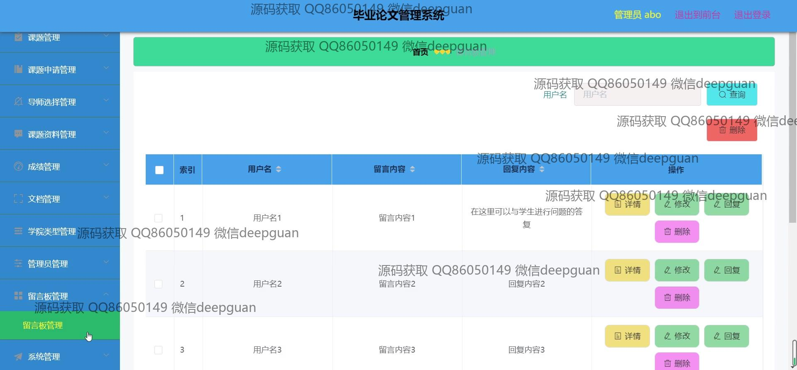
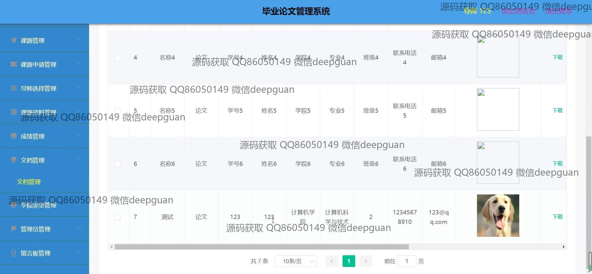
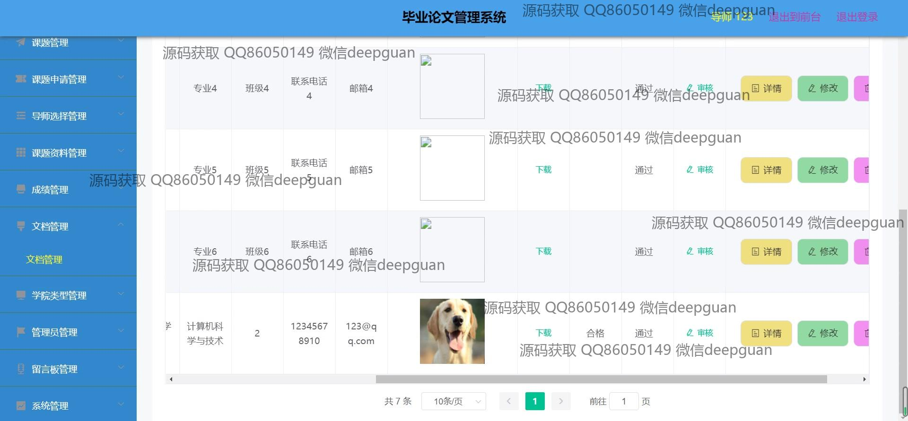

<h1 align="center">毕业论文管理系统+vue</h1>

## 简介
毕业论文管理系统：角色分为管理员、导师、学生；支持学生信息管理、导师选择、课题管理、成绩管理、文档管理、留言反馈、公告发布等功能模块。    --计算机毕业设计源码；毕设源码；java毕业设计源码

## 联系方式

<h3 align="center">获取完整代码与数据库文件 + 微信：deepguan QQ: 86050149 QQ群: 783742310</h3>

<h3 align="center">可帮忙远程部署 包运行成功！提供远程部署、修改代码、设计文档指导、代码讲解等服务！</h3>

## 功能介绍（完整见运行截图）
管理员：登录、注册、退出、用户信息管理、系统公告管理、留言管理、课题审核、轮播图管理、学院类型设置、后台管理操作。主要功能模块包括学生管理、导师管理、成绩管理、文档管理以及系统配置管理，支持对用户和数据的增删改查操作。

导师：查看和编辑个人信息，管理课题资料，选择学生并审核课题申请，发布研究方向及指导计划，查询学生名单及其课题状态，记录和上传学生成绩，参与留言反馈，优化学生课题管理。

学生：注册和登录系统，浏览导师信息及研究方向，申请课题并提交相关资料，查看课题审核状态，上传课题文档及答辩材料，反馈意见或建议，通过个人中心查看和修改个人信息。

访客：浏览系统主页，查看系统公告和相关信息，了解导师及课题概况，访问留言板并提出意见建议。

## 运行截图

本代码来源于网络,仅供学习参考使用!

